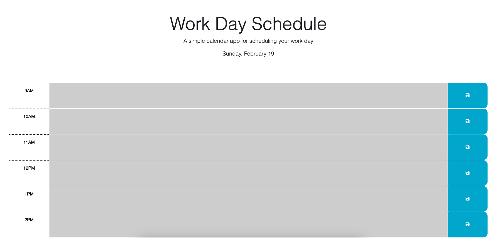

# Work Day Schedule

## Description

This application allows the user to schedule his or her work day with tasks specific to each provided hour block. The current date is displayed at the top of the page, and the hour blocks are color coded based on current time. Time and day will update automatically. Past hours display grey. Current hour displays red. Future hours display green. The user is able to save tasks and keep them in their allotted time slot, even after exiting the application or refreshing the page.

Below is a link to the deployed application followed by a screenshot of the deployed application.

https://miamauro.github.io/work-day-schedule/

